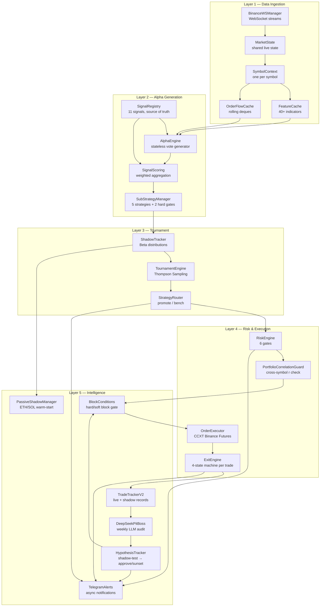
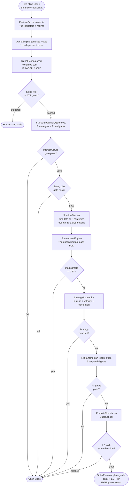
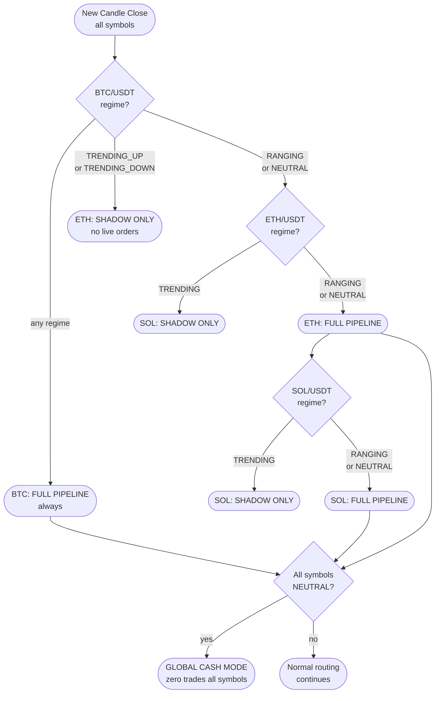
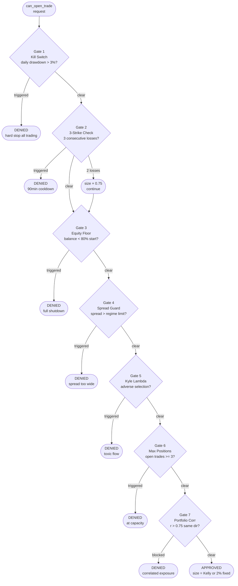
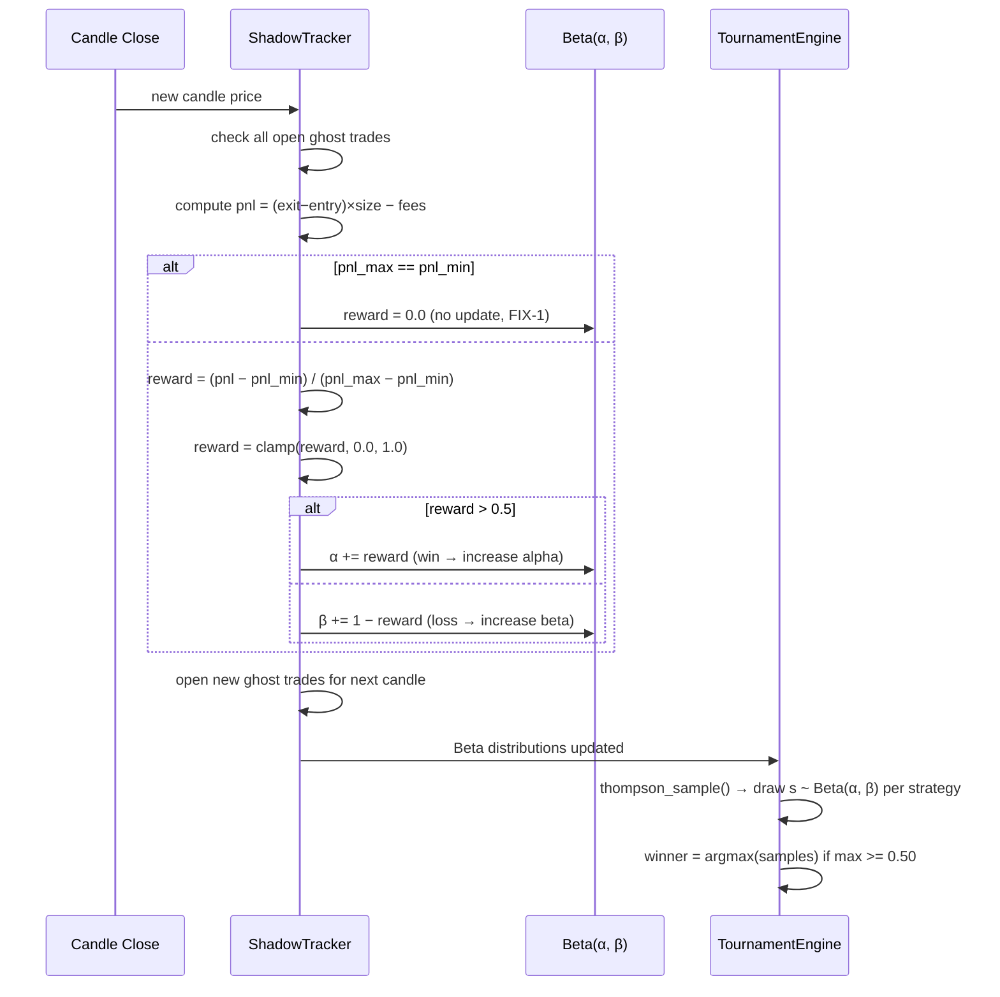
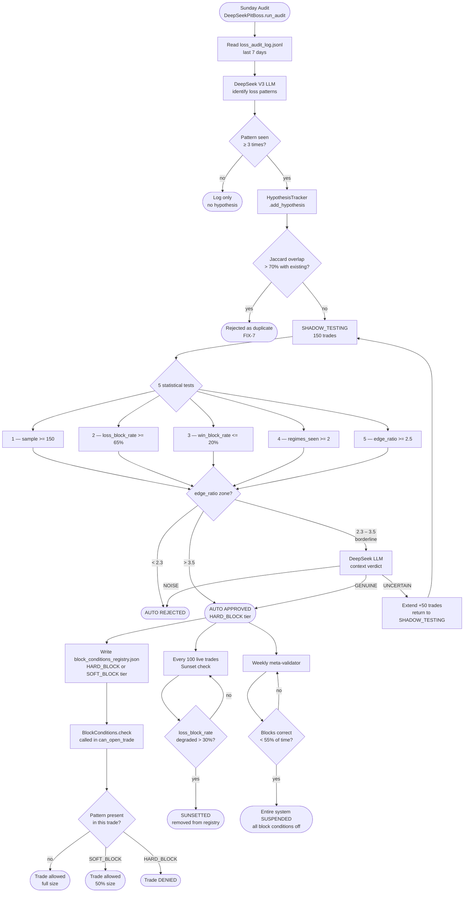

# Grand Prix Alpha-Scalp — Complete Project Context

**Purpose of this document:** A self-contained reference for any LLM (ChatGPT, Gemini, Grok, etc.)
to understand this project completely without needing to read the source code. Paste this entire file
as context before asking for suggestions, reviews, or improvements.

---

## 1. PROJECT OVERVIEW

### What is it?
**Grand Prix Alpha-Scalp** is a production-grade automated crypto futures trading bot.
It scalps BTC/USDT perpetual futures on Binance, using 3-minute candles, 5x leverage.
The name "Grand Prix" reflects the analogy of running multiple strategy "cars" in a race
and selecting the fastest one each candle via statistical sampling.

### Core idea
Most retail bots pick one strategy and run it forever. This bot runs **5 strategies in parallel
simulation** (shadows) at all times and uses **Thompson Sampling** (a Bayesian bandit algorithm)
to select whichever strategy is performing best **right now** in the current market regime.
When no strategy is confident, the bot stays in **Cash Mode** instead of forcing a trade.

### Trading parameters
- Asset: BTC/USDT perpetual futures
- Exchange: Binance Futures (CCXT library)
- Timeframe: 3-minute candles
- Scalp leverage: 5x
- Swing leverage: 3x (4h timeframe, separate)
- Fee model: 0.1% taker per side = 0.2% round-trip (always deducted from P&L)
- Language: Python 3.11
- Tests: pytest, 102 tests passing (Steps 1–8 complete)
- Platform: Windows 11 + VPS deployment

### Operational cost
- LLM (DeepSeek V3): ~$0.052/month (~₹4)
- VPS: ₹400/month
- Recommended capital: ₹50,000+ for economic viability

---

## 2. GENESIS & RESEARCH BACKGROUND

### Why this architecture was chosen

**Problem with simple bots:** A single strategy works in trending markets but bleeds in ranging
markets. Using stop-losses alone doesn't solve the root cause: a strategy that was never suited
to the current regime.

**Solution: Regime-aware multi-strategy selection**
1. Detect the current market regime (trending up/down, ranging, volatile, transition)
2. Run all 5 strategies as "ghost trades" in simulation every candle
3. Maintain Beta probability distributions per strategy using their simulated win/loss history
4. Use Thompson Sampling to draw from each Beta and pick the best one for THIS candle
5. If the best sample is still below 0.50 confidence → go to Cash Mode

**Why Thompson Sampling over simple win-rate?**
Thompson Sampling is from the Multi-Armed Bandit literature. It naturally handles:
- Exploration vs exploitation (tries underperforming strategies occasionally)
- Uncertainty: a new strategy with 5 trades is not trusted more than one with 200
- Regime shifts: bad performance updates the Beta distribution, reducing future selection

**Why 5 strategies instead of 1?**
Markets alternate between regimes rapidly. No single strategy dominates across all regimes:
- Breakout works in trending markets but bleeds in ranging
- Mean Reversion works in ranging but gets destroyed in trending
- Liquidity Sweep Reversal works in all regimes except volatile
- Trend Pullback needs strong directional bias
- Order Flow Momentum works everywhere but with lower edge

Running all 5 and letting the bandit choose is empirically better than regime-switching manually.

**Why shadow simulation instead of live testing?**
Testing on live capital is expensive and slow. Shadow simulation runs all strategies on real
price data with realistic fee deduction (0.1% each leg), building reliable statistics 10-20x
faster than live trading would.

---

## 3. FILE STRUCTURE

```
alpha-scalp-bot/
├── main.py                    # Entry point, orchestration loop
├── config.py                  # All env var defaults, loaded from .env
├── signal_registry.py         # Declarative signal definitions (source of truth)
├── alpha_engine.py            # Stateless signal vote generator (11 signals)
├── signal_scoring.py          # Weighted aggregation → BUY/SELL/HOLD
├── sub_strategy_manager.py    # 5 sub-strategies + Cash Mode selection
├── shadow_tracker.py          # Parallel ghost trade simulation + Beta updates
├── tournament_engine.py       # Thompson Sampling strategy selector
├── strategy_router.py         # Promote/bench lifecycle management
├── risk_engine.py             # 9 risk gates + position sizing
├── exit_engine.py             # 4-state exit machine (per open position)
├── order_executor.py          # CCXT Binance Futures order lifecycle
├── feature_cache.py           # Indicator computation (FeatureSet, 40+ fields)
├── ws_manager.py              # Async WebSocket manager (Binance streams)
├── symbol_context.py          # Per-symbol isolated state container
├── trade_tracker_v2.py        # Trade history + signal attribution + EV
├── telegram_alerts.py         # Async Telegram notifications
├── portfolio_correlation_guard.py  # Cross-symbol Pearson r gate
├── passive_shadow.py          # Warm-start ETH/SOL shadow modes
├── deepseek_pit_boss.py       # Weekly LLM loss audit → generates LossFindings
├── hypothesis_tracker.py      # Full lifecycle: shadow-test → approve/reject/sunset
├── block_conditions.py        # Reads approved hypotheses → blocks/sizes-down trades
├── market_state.py            # Shared live market state container
├── strategy.py                # Base strategy helpers
├── backtest.py                # Historical backtesting runner
├── weights.json               # Frozen signal weights (v1, LOCKED)
├── tests/                     # 102 pytest tests
└── CLAUDE.md                  # Engineer instructions for Claude Code
```

---

## 4. FIVE ARCHITECTURE LAYERS

### Layer 1 — Data Ingestion

**`BinanceWSManager`** (`ws_manager.py`)
- Persistent async WebSocket to Binance Futures streams
- Subscribes to: kline (3m), order book depth, trade stream
- Reconnects with exponential backoff (1s → 60s)
- Proactively reconnects every 23 hours (Binance WS lifetime limit)
- Writes received data directly to `MarketState`

**`SymbolContext`** (`symbol_context.py`)
- One instance per trading symbol (BTC, ETH, SOL), never shared
- Holds all per-symbol state: `feature_cache`, `shadow_tracker`, `tournament_engine`,
  `strategy_router`, `open_positions`, `risk_state`, `candles_seen`
- `ActivationMode.FULL_PIPELINE` or `SHADOW_ONLY`
- `SymbolContextRegistry` manages all contexts + multi-symbol activation rules

**`FeatureCache`** (`feature_cache.py`)
- Computes 40+ technical indicators from OHLCV DataFrame, once per candle
- Returns a `FeatureSet` dataclass (immutable snapshot)
- Key fields: `close, high, low, atr, atr_ratio, bb_squeeze, vwap, adx, regime,
  ob_imbalance, trade_aggression_ratio, liquidity_sweep_bull/bear, cvd_slope, ...`
- **Regime detection (ADX-based):**
  - ADX ≥ 40 → VOLATILE
  - ADX 25–40 + EMA bias → TRENDING_UP or TRENDING_DOWN
  - ADX 18–25 + ATR ratio 0.8–1.2 → TRANSITION
  - ADX < 25 → RANGING

**`OrderFlowCache`** (`feature_cache.py`)
- Rolling deque of order book snapshots (maxlen=10)
- Rolling deque of recent trades (last 30 seconds)
- Used to compute `ob_imbalance`, `trade_aggression_ratio`

---

### Layer 2 — Alpha Generation

**`SignalRegistry`** (`signal_registry.py`)
- Single declarative source of truth for all signals
- Each `SignalMeta` defines: name, default_weight, category, phase, disabled_regimes
- **Phase 1 (always active, 7 signals):**
  - `bb_squeeze` — Bollinger Band squeeze, volatility breakout precursor
  - `vwap_cross` — price crossing VWAP, institutional reference level
  - `liquidity_sweep` — price sweeps beyond recent highs/lows (stop hunts)
  - `trade_aggression` — ratio of aggressive buy/sell market orders
  - `ob_imbalance` — order book bid/ask depth imbalance
  - `mtf_bias` — multi-timeframe trend bias (4h context)
  - `funding_bias` — funding rate signal (positive/negative carry)
- **Phase 2 (unlock at 200 live trades):**
  - `kalman_signal` — Kalman filter trend signal (Q=0.001, R=0.01)
  - `fvg_signal` — Fair Value Gap institutional signal
- **Phase 3 (unlock at 500 live trades):**
  - `equal_highs_lows` — equal highs/lows (institutional sweep targets)
  - `llm_pattern` — LLM-based pattern recognition

**`AlphaEngine`** (`alpha_engine.py`)
- **Stateless** — one shared instance across all symbols
- Generates one `Vote(direction, strength, reason)` per signal per candle
- `direction ∈ {BUY, SELL, HOLD}`, `strength ∈ [0, 1]`
- Returns `AlphaVotes` dataclass with one field per signal
- Handles async funding rate fetch from Binance (TTL cache = 8 hours)
- `funding_bias_vote`: BUY if rate ≤ -0.0005, SELL if ≥ 0.0005 (negative = longs paid)

**`SignalScoring`** (`signal_scoring.py`)
- Weighted aggregation of AlphaVotes → `ScoringResult`
- Loads weights from `weights.json` (frozen, v1)
- **Decision formula:**
  ```
  score = Σ(vote_direction_sign × strength × weight)
  action = BUY   if score ≥ 3.0
         = SELL  if score ≤ -3.0
         = HOLD  otherwise
  ```
- **Consensus check:** if bull_total < 65% of all vote mass → HOLD (conflicted signals)
- **Confidence:** `min(|score| / 6.0, 1.0)`
- **Early-exit filters (returns HOLD immediately):**
  1. ATR = 0 (no volatility data)
  2. Candle spike: `candle_range > 3.0 × ATR` → 3-candle cooldown
  3. ATR ratio outside `[0.5, 3.0]` (abnormal volatility)
- **Phase gating:** zero-weights disabled signals per `SignalRegistry.is_enabled()`
- **Regime gating:** per-regime weight overrides in Phase 2

**`SubStrategyManager`** (`sub_strategy_manager.py`)
- Selects 1 of 5 sub-strategies based on votes + features + regime
- **Hard Gate 1 — Microstructure gate (must pass before any trade):**
  - At least one of `ob_imbalance` or `trade_aggression_ratio` must be non-neutral
  - Neutral bands: ob_imbalance ∈ [0.35, 0.65], aggression ∈ [0.40, 0.60]
  - If both are neutral → Cash Mode (no edge in order flow)
- **Hard Gate 2 — Swing bias gate:**
  - `mtf_bias` (4h) cannot oppose the proposed action
  - BUY signal + SELL swing bias → blocked
- **5 strategies (priority order):**
  1. **LiquiditySweepReversal** — `liquidity_sweep` required, all regimes
  2. **Breakout** — `bb_squeeze` required, TRENDING/VOLATILE regimes only
  3. **TrendPullback** — `mtf_bias` required, TRENDING regimes only
  4. **VWAPMeanReversion** — `vwap_cross` required, RANGING/NEUTRAL regimes
  5. **OrderFlowMomentum** — `trade_aggression` required, all regimes
- If no strategy matches or gates fail → Cash Mode (Strategy 6)

---

### Layer 3 — Tournament

**`ShadowTracker`** (`shadow_tracker.py`)
- Simulates all 5 strategies as "ghost trades" every candle
- Maintains `Beta(α, β)` distribution per `(strategy, symbol)` pair
- **Ghost trade lifecycle:**
  - `open_ghost(strategy, entry_price, side, size)` → ghost_id
  - `close_ghost(ghost_id, exit_price)` → P&L result + Beta update
- **Fee model (critical):** 0.1% taker on entry + 0.1% on exit = 0.2% round-trip
  ```python
  fee = entry_price × size × 0.001 + exit_price × size × 0.001
  pnl_long  = (exit - entry) × size - fee
  pnl_short = (entry - exit) × size - fee
  ```
- **Reward normalization (min-max, FIX-1 div-by-zero guard):**
  ```python
  if pnl_max == pnl_min:
      reward = 0.0
  else:
      reward = (pnl - pnl_min) / (pnl_max - pnl_min)
  reward = clamp(reward, 0.0, 1.0)
  ```
- **Beta update:**
  ```python
  if reward > 0.5: alpha += reward      # win → increase α
  else:            beta_param += 1 - reward  # loss → increase β
  ```
- `thompson_sample()` → draws one sample per strategy Beta
- Rolling deque (maxlen=50) for correlation computation between strategies
- All trades appended to `shadow_trades.jsonl` with regime, fee, weights_version

**`TournamentEngine`** (`tournament_engine.py`)
- Runs Thompson Sampling tournament every candle
- `run_tournament(eligible: list[str])` → `TournamentResult(winner, sample, samples, expectancy, cash_mode, reason)`
- **Cash Mode trigger:** `max(samples) < 0.50` (CASH_SAMPLE_THRESHOLD)
- **Expectancy normalization:**
  ```python
  raw_expectancy = 2 × mean_win_probability − 1  ∈ [-1, +1]
  scaled = (raw - raw_min) / (raw_max - raw_min)  ∈ [0, 1]
  # If all identical: scaled = 0.5 for all (equal-expectancy fallback)
  ```
- **HmmScheduler (FIX-5):**
  - Ensures HMM is trained on 87,000 candles (~6 months 3m bars) before first use
  - Sunday retrain when `new_candles_since_last_train > 500`
  - ADX-based regime used as fallback if HMM unavailable

**`StrategyRouter`** (`strategy_router.py`)
- Manage promote/bench lifecycle for strategies
- **Burn-in gate (FIX-2):** strategy must have ≥50 candles AND ≥2 distinct regimes
  - Prevents promoting a strategy that was only seen in TRENDING markets
- **Velocity check:** if win-rate drops >30% in last 10 trades → bench
- **Correlation check:** Pearson r ≥ 0.85 between two strategies → bench the lower-ranked one
  - Prevents redundant strategies eating capital
- `tick(regime, tournament_winner)` → confirmed winner or None
- Sends Telegram alert on all bench/promote events
- Key constants:
  ```python
  BURN_IN_CANDLES = 50
  BURN_IN_MIN_REGIMES = 2
  VELOCITY_CHECK_THRESHOLD = 0.30
  VELOCITY_WINDOW = 10
  CORRELATION_BENCH_THRESHOLD = 0.85
  CORRELATION_MIN_SAMPLES = 20
  ```

---

### Layer 4 — Risk & Execution

**`RiskEngine`** (`risk_engine.py`)
- Centralised risk management. `can_open_trade()` runs 6+ gates in sequence.
- **Gate 1 — Kill Switch:** daily drawdown > 3% → hard stop all trading
- **Gate 2 — Three-Strike:** 3 consecutive losses → 90-minute cooldown
  - At 2 consecutive losses: position size reduced to 0.75×
- **Gate 3 — Equity Floor:** balance < 80% of starting balance → full shutdown
- **Gate 4 — Spread Guard:** regime-adjusted max spread check
  - RANGING: 1.0× baseline, TRENDING: 1.5×, VOLATILE: 0.75×
- **Gate 5 — Kyle's Lambda:** adverse selection filter (order flow toxicity)
- **Gate 6 — Max Positions:** concurrent open trades cap (default 3)
- **Plus Gate 7 — Portfolio Correlation Guard** (added in Step 12)

- **Dynamic leverage formula:**
  ```
  base = regime_ceiling
    TRENDING: 5.0×, RANGING: 3.0×, VOLATILE: 2.0×, TRANSITION: 2.0×

  × Thompson confidence multiplier:
    score < 0.70  → 0.50×
    score 0.70–0.85 → 0.75×
    score > 0.85  → 1.00×

  + Negative funding bonus (if funding < -0.01% AND direction=BUY):
    leverage_bonus = +1.0 (longs are being paid to hold)
    (only if raw_leverage < ceiling - 1.0)

  × Drawdown scaling:
    drawdown > 3.5% → 0.25×
    drawdown > 2.0% → 0.50×
  ```

- **Kelly Criterion** (disabled until 300 live trades, max 10%):
  ```python
  f = win_rate - (loss_rate / win_loss_ratio)
  kelly_fraction = min(f, KELLY_MAX_FRACTION)
  # Ramp: scales linearly from 0% to full between 300-500 trades
  ```

- **Per-symbol vs global state:**
  - `daily_pnl`, `consecutive_losses` → PER SYMBOL
  - `equity_floor`, `kill_switch` → GLOBAL (all symbols share)

**`PortfolioCorrelationGuard`** (`portfolio_correlation_guard.py`)
- **Shared** — the only component that intentionally sees all symbols simultaneously
- Maintains rolling 50-candle return series per symbol
- `check(proposed_symbol, proposed_direction, open_positions)` → `CorrelationResult`
- Blocks trade if Pearson r > 0.75 AND same direction between proposed symbol and any open symbol
- Requires ≥20 samples before trusting (no false positives on startup)
- Helper: custom `_pearson(x, y)` — avoids scipy/numpy overhead for small arrays

**`OrderExecutor`** (`order_executor.py`)
- CCXT wrapper for Binance Futures order lifecycle
- On startup: `reconcile_position()` — detects positions open while bot was down
- Sets leverage and margin type before each trade
- Market orders + bracket SL/TP placement
- Paper slippage model: realistic (not zero) when `PAPER_TRADING_MODE=true`
- Partial fill rollback if fill tolerance not met (<95% of intended size)
- Error classification: `FatalExchangeError` (auth failure, IP ban) vs transient

**`ExitEngine`** (`exit_engine.py`)
- **One instance per open position, never reused**
- Created on trade entry, destroyed on exit
- **4-state machine:**

  ```
  State 0 — ENTRY
    Record: entry_price, entry_atr, regime_at_entry
    Wait for price to move +0.5% (SCALP_TRAIL_ACTIVATE_PCT)

  State 1 — BREAKEVEN
    Action: move SL to entry_price (locked in breakeven)
    Advance to TRAILING on next candle

  State 2 — TRAILING (regime-dependent)
    RANGING/NEUTRAL:
      Fixed TP at entry ± 1.5×ATR
      No trailing stop (fixed target only)

    TRENDING:
      Trail at 2.0×ATR initially
      Tighten to 1.0×ATR when profit ≥ +5%
      Tighten to 0.75×ATR when profit ≥ +10%
      (ratchet — only tightens, never loosens)

    VOLATILE:
      If in profit: tight 1.0×ATR trail immediately
      If NO profit after 4 candles: force market exit (time stop)

  State 3 — EXIT
    Log: exit_reason, exit_price, state_history, hold_duration
  ```

- `on_candle(current_price, current_atr)` → `ExitSignal(action, new_sl, exit_price, exit_reason, state)`
- `to_dict()` for persistence (bot_state.json)

---

### Layer 5 — Intelligence

**`TradeTrackerV2`** (`trade_tracker_v2.py`)
- Records all live trades to `trades.jsonl` and shadow trades to `shadow_trades.jsonl`
- P&L calculation: `(exit_value - entry_cost) - taker_fee_both_legs`
- Per-signal attribution: every trade stores full `ScoringResult`
- Tracks win streaks, loss streaks, per-signal win rates and EV
- **Expected Value (EV):**
  ```python
  EV = (win_rate × avg_win_pnl) - (loss_rate × avg_loss_pnl)
  ```
- `reset_daily()` called at UTC midnight for daily stats

**`DeepSeekPitBoss`** (`deepseek_pit_boss.py`)
- Weekly audit running every Sunday — **entry point of the closed learning loop**
- **Phase 1:** Read last 7 days of `loss_audit_log.jsonl` → send to DeepSeek V3 LLM
  → parse structured `LossFindings` → append to `loss_audit_log.jsonl`
- **Phase 2:** Find patterns with ≥3 occurrences → call `HypothesisTracker.add_hypothesis()`
- **Critical rule:** NEVER writes to live trading files or weights. Audit-only.
- Archive rotation: `shadow_trades.jsonl` rotated on month boundary or >50MB
- LLM cost: ~$0.001/audit (DeepSeek V3)

**`HypothesisTracker`** (`hypothesis_tracker.py`)
- Manages the full lifecycle of every loss-pattern hypothesis generated by PitBoss
- **Lifecycle:** `SHADOW_TESTING → APPROVED / REJECTED` then `→ SUNSETTED`
- **Shadow testing:** runs 150 trades of statistical proof before anything is approved
- **5 auto-approval tests (no human needed):**
  1. Sample size ≥ 150 shadow trades
  2. `loss_block_rate ≥ 65%` (blocks most losses)
  3. `win_block_rate ≤ 20%` (doesn't kill winners)
  4. Regimes validated ≥ 2 (not regime-overfit)
  5. `edge_ratio = loss_block_rate / win_block_rate ≥ 2.5`
- **Hybrid LLM verdict for borderline cases (edge 2.3–3.5):**
  - DeepSeek returns `GENUINE` → approve
  - DeepSeek returns `NOISE` → reject
  - DeepSeek returns `UNCERTAIN` → extend shadow +50 trades and retest
  - edge < 2.3 → auto-reject without calling LLM
  - edge > 3.5 → auto-approve without calling LLM
- **Jaccard deduplication (FIX-7):** if new hypothesis > 70% token-overlap with existing → reject duplicate
- **Sunset check:** every 100 live trades after approval — if `loss_block_rate` degraded >30% vs approval stats → sunset
- **Meta-validator (weekly):** if approved hypotheses collectively block >45% winners → suspend entire system
- **Cap:** max 5 active block conditions at any time (prevents over-filtering)
- Persistence: `shadow_hypotheses.jsonl` (all history) + `block_conditions_registry.json` (approved only)

**`BlockConditions`** (`block_conditions.py`)
- Reads `block_conditions_registry.json` at runtime
- Called in `can_open_trade()` as the final gate after all 6 risk gates
- **Dual confidence tiers:**
  - `HARD_BLOCK` (edge > 3.5) → trade fully denied
  - `SOFT_BLOCK` (edge 2.5–3.5) → trade allowed at 50% position size
- `check(pattern_keys: set[str], regime: str)` → `BlockResult(blocked, soft_block, hypothesis_id, reason)`
- **Status: NOT YET WIRED into `can_open_trade()`** — will be enabled after 200 live trades
  prove the hypothesis system is adding value, not over-filtering

**`PassiveShadowManager`** (`passive_shadow.py`)
- Warms up Beta distributions for ETH/USDT and SOL/USDT before they go live
- Runs full shadow pipeline every candle for passive symbols:
  `FeatureCache → AlphaEngine → SubStrategyManager → ShadowTracker → TournamentEngine → StrategyRouter`
- Ghost trades use: SL = 1.5×ATR, TP = 2.0×ATR, max_candles_alive = 5
- Ensures ETH/SOL have reliable Beta estimates before activation (warm start)

**`TelegramAlerts`** (`telegram_alerts.py`)
- Async, rate-limited (1-second minimum interval between sends)
- HTML formatting with emoji regime labels
- Mode tag: PAPER / DEMO / LIVE
- Sends: trade entry, exit, trail activation, bench/promote events, daily stats
- Key files backed up to Telegram every 5 minutes + on trade close

---

## 5. COMPLETE DATA FLOW — SINGLE CANDLE (LIVE MODE)

```
1. BinanceWSManager receives 3m kline close for BTC/USDT
   └─ Writes to MarketState

2. Main loop detects new candle
   └─ Routes to BTC SymbolContext

3. FeatureCache.compute(df) → FeatureSet (40+ indicators)
   └─ Includes: atr, regime, vwap, bb_squeeze, ob_imbalance, trade_aggression, ...

4. OrderFlowCache.add_snapshot() / add_trade()

5. AlphaEngine.generate_votes_with_funding(features, symbol) → AlphaVotes
   └─ 11 signals each return Vote(direction, strength, reason)

6. SignalScoring.score(votes, features) → ScoringResult
   └─ Weighted sum → BUY/SELL/HOLD + confidence
   └─ Filters: spike guard, ATR ratio guard

7. SubStrategyManager.select(votes, features) → SubStrategy
   └─ Hard Gate 1: microstructure check
   └─ Hard Gate 2: swing bias check
   └─ Returns first matching strategy or Cash Mode

8. ShadowTracker simulates all 5 strategies this candle
   └─ Opens/closes ghost trades with realistic fees
   └─ Updates Beta(α, β) per strategy

9. TournamentEngine.run_tournament(eligible) → TournamentResult
   └─ Draws from each Beta
   └─ max sample < 0.50 → Cash Mode
   └─ Returns winner + expectancy scores

10. StrategyRouter.tick(regime, winner) → confirmed winner or None
    └─ Burn-in check (≥50 candles, ≥2 regimes)
    └─ Velocity check (win-rate drop)
    └─ Correlation check (redundant strategies)

11. IF action != CASH_MODE:
    └─ RiskEngine.can_open_trade() — 6 gates
    └─ PortfolioCorrelationGuard.check()
    └─ IF all pass:
       └─ OrderExecutor.place_order(side, size, sl, tp)
       └─ ExitEngine instance created for this position
       └─ TelegramAlerts.send_entry(...)

12. Every subsequent candle for open position:
    └─ ExitEngine.on_candle(price, atr) → ExitSignal
    └─ IF State 3 (EXIT):
       └─ OrderExecutor.close_position()
       └─ TradeTrackerV2.record_trade(...)
       └─ TelegramAlerts.send_exit(...)
       └─ ExitEngine destroyed
```

---

## 6. MULTI-SYMBOL ACTIVATION RULES

```
Every candle → SymbolContextRegistry.route_agent_activation() runs:

BTC/USDT:  ALWAYS → full pipeline
ETH/USDT:  IF BTC regime is NEUTRAL/RANGING → full pipeline
           ELSE → shadow only (builds Beta, no live orders)
SOL/USDT:  IF BTC is NEUTRAL AND ETH is NEUTRAL → full pipeline
           ELSE → shadow only

ALL symbols NEUTRAL simultaneously → Global Cash Mode
  (no trades on any symbol)
```

**Why this hierarchy?** BTC dominates crypto correlation. When BTC is trending, ETH and SOL
move with it, so trading them separately creates correlated exposure. Wait for BTC to be flat
before opening ETH/SOL positions.

**Component sharing rules:**
| Component | Shared? | Why |
|-----------|---------|-----|
| `SymbolContext` | NOT shared | Fully isolated per symbol |
| `AlphaEngine` | SHARED (stateless) | Reads only, no state |
| `ShadowTracker` | SHARED but keyed by (strategy, symbol) | Beta distributions never mix |
| `RiskEngine` | SHARED with split state | daily_pnl per symbol; equity_floor global |
| `PortfolioCorrelationGuard` | SHARED | Only component that NEEDS cross-symbol access |
| `ExitEngine` | NOT shared | One per open position, destroyed on exit |

---

## 7. SIGNAL WEIGHTS (FROZEN v1)

Weights are stored in `weights.json` and **locked** (`WEIGHTS_LOCKED=true`).
They are not changed during live trading. The `WeightOptimizer` was removed.

```
Default weights (from SignalRegistry):
  bb_squeeze:        1.2  (high — breakout precursor)
  vwap_cross:        1.0  (medium — structure)
  liquidity_sweep:   1.5  (high — stop hunt confirmation)
  trade_aggression:  1.3  (high — order flow)
  ob_imbalance:      0.8  (medium — supporting)
  mtf_bias:          0.7  (medium — context)
  funding_bias:      0.5  (low — macro bias)

Phase 2 (unlock at 200 trades):
  kalman_signal:     1.1  (replaces EMA+NW, more adaptive)
  fvg_signal:        0.9  (institutional gap fills)

Phase 3 (unlock at 500 trades):
  equal_highs_lows:  0.8
  llm_pattern:       0.6

Constraints:
  MIN_WEIGHT = 0.1
  MAX_WEIGHT = 3.0 (hard cap per signal, prevents one signal dominating)
```

---

## 8. RISK PARAMETERS (KEY .ENV VALUES)

```env
RISK_PER_TRADE=0.02          # 2% of balance per trade
DAILY_DRAWDOWN_LIMIT=0.03    # 3% daily loss → kill switch
EQUITY_FLOOR_PCT=0.80        # 80% of start balance → shutdown
THREE_STRIKE_COOLDOWN=5400   # 90 minutes in seconds
MAX_OPEN_POSITIONS=3
MAX_CONCURRENT_TRADES=5

ATR_SL_MULTIPLIER=2.0        # Default stop loss distance
ATR_SL_MULTIPLIER_MIN=1.8    # Minimum (never tighter)
ATR_TP_MULTIPLIER=3.0        # Target profit distance

SCALP_TRAIL_ACTIVATE_PCT=0.005  # 0.5% profit → move SL to breakeven
TRAIL_TIGHTEN_AT_5PCT=1.0       # 5% profit → tighten to 1×ATR
TRAIL_TIGHTEN_AT_10PCT=0.75     # 10% profit → tighten to 0.75×ATR

THOMPSON_NONE_THRESHOLD=0.55    # Below this → Cash Mode
BURN_IN_CANDLES=50
DISTINCT_REGIMES_REQUIRED=2

PORTFOLIO_CORRELATION_THRESHOLD=0.75  # Block if r > 0.75 same direction

KELLY_MIN_TRADES=300         # Kelly disabled until 300 live trades
KELLY_MAX_FRACTION=0.10      # Never bet more than 10% Kelly
```

---

## 9. 5 HMM REGIME STATES

```
TRENDING_UP    — ADX 25+, price above EMA, directional
TRENDING_DOWN  — ADX 25+, price below EMA, directional
RANGING        — ADX < 25, mean-reverting
VOLATILE       — ADX 40+, high ATR ratio
TRANSITION     — ADX 18–25, ATR ratio 0.8–1.2 (uncertain)
```

**TRANSITION regime rule:** Only `OrderFlowMomentum` is allowed (safest strategy in
uncertain conditions). All other strategies are blocked.

**HMM training:**
- Initial: 87,000 candles (~6 months of 3m BTC data, FIX-5)
- Fallback: ADX-based detection if HMM unavailable
- Retrain: every Sunday if >500 new candles seen since last retrain

---

## 10. PERSISTENCE & CRASH RECOVERY

```
bot_state.json        — written atomically after EVERY state change
                        (write to .tmp → os.replace() prevents corruption)
trades.jsonl          — all closed live trades
shadow_trades.jsonl   — all shadow simulation records (rotate at 50MB)
loss_audit_log.jsonl  — all losing trades with full signal context
weights_v1.json       — frozen base weights
weights_active.json   — pointer to active version
```

**Startup reconciliation sequence:**
1. Load `bot_state.json`
2. Fetch live positions from exchange via REST
3. Reconcile: position missing → closed while down, mismatch → partial fill
4. Restore Beta distributions from saved state
5. Restore cooldown states (3-strike timer, etc.)
6. Restore/reset daily PnL counters
7. Send "Bot restarted — reconciliation complete" to Telegram

**Telegram backup:** Key files auto-sent every 5 minutes AND on each trade close. Cost: ₹0.

---

## 11. BUILD PROGRESS (STEPS 1–13)

| Step | Component | Status |
|------|-----------|--------|
| 1 | Weights frozen, WEIGHTS_LOCKED=true | ✅ Done |
| 2 | RiskEngine: 3-strike, equity floor, regime R:R, Kelly | ✅ Done |
| 3 | Spike filter, spread guard, ATR validation | ✅ Done |
| 4 | SignalRegistry — declarative signal metadata | ✅ Done |
| 5 | SubStrategyManager — 5 strategies + 2 hard gates | ✅ Done |
| 6 | ShadowTracker — ghost trades + Beta distributions | ✅ Done |
| 7 | TournamentEngine — Thompson Sampling | ✅ Done (12 tests) |
| 8 | StrategyRouter — promote/bench lifecycle | ✅ Done (12 tests) |
| 9 | ExitEngine — 4-state machine | ✅ Done (4 regression tests) |
| 10 | DeepSeekPitBoss — weekly LLM audit | ✅ Done |
| 11 | SymbolContext — per-symbol isolation | ✅ Done |
| 12 | PortfolioCorrelationGuard — final risk gate | ✅ Done |
| 13 | ETH/SOL passive shadow + paper trading 2 weeks | ✅ Done |

**Total tests: 102 passing**

---

## 12. KEY ENGINEERING DECISIONS & CRITICAL FIXES

### FIX-1: Division-by-zero in reward normalization
When all ghost trades have identical P&L (e.g., all hit the same SL), `pnl_max == pnl_min`.
Fix: `if pnl_max == pnl_min: reward = 0.0` — neutral, no update.

### FIX-2: Burn-in requires BOTH candles AND regimes
Original: just 50 candles. Problem: 50 candles all in TRENDING_UP doesn't tell you how
the strategy performs in RANGING markets. Fix: require ≥2 distinct regimes seen.

### FIX-3: Shadow fees always deducted (0.2% round-trip)
Without fee deduction, shadow trades appear profitable when they're actually break-even.
This creates false confidence. Every ghost trade deducts entry + exit taker fee.

### FIX-4: ExitEngine 4 mandatory regression tests
```
test_ranging_exit_hits_fixed_tp_not_trailing()
test_trending_trail_tightens_at_5pct_profit()
test_volatile_time_exit_triggers_at_candle_4()
test_breakeven_state_transitions_correctly()
```

### FIX-5: HMM trained on 6 months of data before first use
If the HMM sees only 100 candles before making regime decisions, it will be overfit.
Initial training requires 87,000 candles (~6 months of 3m BTC bars).

### FIX-6: Kalman parameters Q=0.001, R=0.01
Q = process noise (how much the true trend changes per candle)
R = measurement noise (how noisy each price observation is)
R/Q = 10 means: trust recent prices moderately, filter noise aggressively.

### FIX-7: Hypothesis semantic overlap check (>70% = reject)
When DeepSeekPitBoss generates improvement hypotheses, similar ones are deduplicated
using text overlap scoring. Prevents the same pattern being "discovered" 5 times.

### FIX-8: Negative funding rate increases leverage for longs
When funding < -0.01%, long positions are paid to hold. This is rare but significant.
In this case, add +1.0 to leverage ceiling (longs have asymmetric advantage).

### FIX-9: Paper slippage model = realistic (not zero)
When `PAPER_TRADING_MODE=true`, slippage is simulated based on order size and
observed spread, not assumed to be zero (which would make paper results unrealistically good).

### FIX-10: All symbols NEUTRAL → global Cash Mode
When BTC, ETH, AND SOL are all in RANGING/NEUTRAL regime simultaneously,
the market is flat across the board. No edge exists. Global Cash Mode activated.

---

## 13. WHAT MAKES THIS DIFFERENT FROM A SIMPLE BOT

1. **Bayesian strategy selection** — not rule-based, not ML-based, but Bayesian bandit
   updating in real-time based on simulated performance
2. **Shadow simulation** — 5 strategies always running in parallel without risking capital,
   continuously updating Beta distributions so live selection is always informed
3. **Regime-awareness** — every decision is conditioned on the current market regime.
   A strategy that works in TRENDING markets is blocked in RANGING markets.
4. **Multi-symbol activation hierarchy** — ETH/SOL only activated when BTC is neutral,
   preventing correlated exposure disguised as diversification
5. **Two hard gates** — microstructure gate (order flow must have directional evidence)
   and swing bias gate (4h trend cannot oppose trade direction)
6. **State machine exits** — not just static SL/TP, but a 4-state machine that tightens
   the trail as profit grows and force-exits volatile positions after 4 candles
7. **No weight optimization during live trading** — weights are frozen. The bandit handles
   strategy selection; we don't risk overfitting weights to recent data.
8. **Crash-safe persistence** — atomic writes, startup reconciliation, Telegram backups.
   If the VPS crashes mid-trade, the bot detects and handles the orphaned position.

---

## 14. KNOWN LIMITATIONS & OPEN QUESTIONS

1. **HMM regime model** — the Hidden Markov Model for regime detection is not yet integrated
   into `FeatureCache`. Currently using ADX-based fallback. HMM would be more accurate
   at detecting TRANSITION regimes.

2. **Kalman signal** — Phase 2, not active until 200 live trades. The Kalman filter
   (Q=0.001, R=0.01) replaces EMA+NW signals with an adaptive trend estimate.

3. **Swing trading** — a separate 4h swing strategy exists (`swing_strategy.py`) at 3x
   leverage. It feeds `mtf_bias` votes into the scalp pipeline but otherwise is independent.

4. **Kelly ramp** — Kelly is disabled until 300 trades, then ramped linearly to full Kelly
   at 500 trades. Before this, position size is fixed fractional (2% risk per trade).

5. **LLM hypothesis action loop** — DeepSeekPitBoss generates hypotheses about why trades
   lose, but the loop to actually TEST those hypotheses in shadow simulation (and potentially
   adjust strategies) is not yet closed. It logs findings, doesn't auto-apply them.

6. **Correlation computation in StrategyRouter** — uses Pearson on recent_pnl lists which
   may be short (10 trades). Minimum 20 samples required before trusting correlation score.

---

## 15. HOW TO ASK FOR SUGGESTIONS

When asking other LLMs to review or suggest improvements, paste this entire document and
then ask specific questions. Examples:

- "Review the ExitEngine state machine logic in Section 4, Layer 4. Is there a better way
  to handle the VOLATILE regime time-exit?"

- "In the TournamentEngine, the CASH_SAMPLE_THRESHOLD is 0.50. Should it be higher?
  What's the statistical argument for a different threshold?"

- "The ShadowTracker uses Beta(α, β) distributions. Would a different reward signal
  (e.g., Sharpe contribution instead of normalized P&L) give better Thompson Sampling
  outcomes?"

- "The multi-symbol activation hierarchy in Section 6 blocks ETH when BTC is trending.
  Is there a more nuanced approach that wouldn't leave ETH opportunities on the table?"

- "Suggest improvements to the Kelly Criterion ramp in Section 8. Is starting at 300 live
  trades too conservative given the shadow simulation data available?"

---

## 16. ROADMAP — FUTURE MILESTONES

> Gated by live trade count. Check this before starting any new session.
> Source of truth: `ROADMAP.md` (always sync both files when updating).

### Current Status (as of March 2026)

| Item | State |
|------|-------|
| Build steps | 13 / 13 complete |
| Tests | 242 passing |
| Mode | Demo trading (paper) |
| BTC/USDT | Full pipeline active |
| ETH/USDT | Shadow only (warming Betas) |
| SOL/USDT | Shadow only (warming Betas) |

---

### Phase 2 — After 50 Live Trades

- [ ] Verify Three-Strike cooldown triggers correctly in live conditions
- [ ] Verify equity floor check reads real balance (not paper balance)
- [ ] First DeepSeek PitBoss Sunday audit — check `loss_audit_log.jsonl` output
- [ ] Review `shadow_trades.jsonl` — confirm ETH/SOL Beta distributions are building
- [ ] Confirm `bot_state.json` is writing atomically on every state change
- [ ] Test restart reconciliation: kill bot mid-trade, restart, verify position restored
- [ ] Check Telegram alert latency on entry/exit events

---

### Phase 2 — After 200 Live Trades

- [ ] **Activate Kalman signal** (`kalman_signal`, Q=0.001, R=0.01)
  - Replaces EMA cross + NW signal, more adaptive
- [ ] **Activate FVG signal** (`fvg_signal`, institutional family)
- [ ] Review Kelly readiness — needs 300 trades minimum before enabling
- [ ] Evaluate ETH/USDT Beta distributions — ready for live activation?
- [ ] First HypothesisTracker approval cycle review
  - Check `block_conditions_registry.json` for any approved block conditions

---

### Phase 2 — After 300 Live Trades

- [ ] **Enable Kelly sizing** (`KELLY_ENABLED=true`, `KELLY_MIN_TRADES=300`)
  - Ramp: 300 trades = starts, 500 trades = full fraction, cap stays at 10%
- [ ] **Activate ETH/USDT live** (if Beta distributions are warm)
  - Change `PASSIVE_SHADOW_SYMBOLS` to `SOL/USDT` only
  - Confirm `route_agent_activation()` is working correctly

---

### Phase 3 — After 500 Live Trades

- [ ] **Activate `equal_highs_lows` signal** (institutional family)
- [ ] **Activate `llm_pattern` signal** (contextual family, DeepSeek)
- [ ] **Activate SOL/USDT live** (if ETH is stable and Beta is warm)
- [ ] Full Kelly ramp complete — review position sizing in production
- [ ] Walk-forward validation: split live trades into in-sample / out-of-sample
- [ ] Review DeepSeek PitBoss audit quality after 3+ Sunday cycles
- [ ] Submit methodology paper to arxiv (cs.LG / q-fin.TR)

---

### Infrastructure — Any Time

- [ ] **VPS deployment** — move from local Windows to Linux VPS
  - Set up systemd service for auto-restart
- [ ] **Telegram backup** — verify 5-minute auto-backup of key files
- [ ] **`shadow_trades.jsonl` rotation** — confirm PitBoss archive logic works at 50MB
- [ ] **Log rotation** — confirm Loguru rotation doesn't fill disk on VPS
- [ ] **HMM retrain** — confirm Sunday retrain triggers after 500+ new candles

---

### Known Tech Debt (Low Priority — Wire These In)

| Item | File | Status |
|------|------|--------|
| `PassiveShadowManager.start()` not called | `main.py` | Pending |
| `registry.route_agent_activation()` not called per candle | `main.py` | Pending |
| `PortfolioCorrelationGuard` not wired into `RiskEngine.can_open_trade()` | `risk_engine.py` | Pending |
| `ExitEngine` instances not created on trade entry | `main.py` | Pending |
| Paper slippage model not applied | `order_executor.py` | Pending |

---

### Completed Steps (Do Not Touch)

| Step | Component | Tests |
|------|-----------|-------|
| Step 1 | WeightOptimizer frozen, WEIGHTS_LOCKED | — |
| Step 2 | RiskEngine — Three-Strike, equity floor, Kelly gate | ✅ |
| Step 3 | Spike filter, spread guard, ATR validation | ✅ |
| Step 4 | SignalRegistry — 11 signals declarative | ✅ |
| Step 5 | SubStrategyManager — 5 strategies + 2 hard gates | ✅ |
| Step 6 | ShadowTracker — Beta distributions, ghost trades | ✅ |
| Step 7 | TournamentEngine — Thompson Sampling | ✅ |
| Step 8 | StrategyRouter — promote/bench lifecycle | ✅ |
| Step 9 | ExitEngine — 4-state machine | ✅ |
| Step 10 | DeepSeekPitBoss + HypothesisTracker + BlockConditions | ✅ |
| Step 11 | SymbolContext + SymbolContextRegistry | ✅ |
| Step 12 | PortfolioCorrelationGuard | ✅ |
| Step 13 | PassiveShadowManager — ETH/SOL shadow | ✅ |
| FIX-7 | Jaccard similarity dedup in HypothesisTracker | ✅ |
| Infra | pandas_ta shim, .venv, requirements.txt | ✅ |
| Docs | README, RESEARCH.md, ROADMAP.md, context.md | ✅ |

---

## 17. ARCHITECTURE DIAGRAMS

> These diagrams use Mermaid syntax. They render visually on GitHub, VS Code (Markdown Preview
> Mermaid extension), Notion, and most AI chat interfaces. Even as plain text they are readable.

---

### Diagram 1 — Full System Architecture (5 Layers)



---

### Diagram 2 — Single Candle Data Flow (BTC Live Mode)



---

### Diagram 3 — ExitEngine 4-State Machine

```mermaid
stateDiagram-v2
    [*] --> ENTRY : trade opened\nrecord entry_price, atr, regime

    ENTRY --> BREAKEVEN : price moved +0.5%\n(SCALP_TRAIL_ACTIVATE_PCT)
    ENTRY --> EXIT : force exit\n(VOLATILE + 4 candles + no profit)

    BREAKEVEN --> TRAILING : SL moved to entry_price\n(locked breakeven)
    BREAKEVEN --> EXIT : SL hit at entry\n(breakeven stop)

    TRAILING --> TRAILING : update trail / check TP\n(regime-dependent logic)
    TRAILING --> EXIT : TP hit (RANGING)\nor trail stop hit (TRENDING/VOLATILE)\nor time stop (VOLATILE candle 4)

    EXIT --> [*] : log exit_reason\nexit_price, hold_duration\nExitEngine destroyed

    note right of TRAILING
        RANGING:  fixed TP = entry ± 1.5×ATR
        TRENDING: trail 2.0×ATR → 1.0×ATR (+5%) → 0.75×ATR (+10%)
        VOLATILE: 1×ATR trail if profit; force exit at candle 4
    end note
```



---

### Diagram 4 — Thompson Sampling Tournament

```mermaid
flowchart LR
    subgraph Betas["Beta Distributions\n(updated each shadow close)"]
        B1["Strategy 1 — Breakout\nBeta(α₁, β₁)"]
        B2["Strategy 2 — VWAP Rev\nBeta(α₂, β₂)"]
        B3["Strategy 3 — Liq Sweep\nBeta(α₃, β₃)"]
        B4["Strategy 4 — Trend Pull\nBeta(α₄, β₄)"]
        B5["Strategy 5 — OFM\nBeta(α₅, β₅)"]
    end

    subgraph Samples["Thompson Sample\n(draw one per Beta)"]
        S1[s₁ ~ Beta(α₁,β₁)]
        S2[s₂ ~ Beta(α₂,β₂)]
        S3[s₃ ~ Beta(α₃,β₃)]
        S4[s₄ ~ Beta(α₄,β₄)]
        S5[s₅ ~ Beta(α₅,β₅)]
    end

    B1 --> S1
    B2 --> S2
    B3 --> S3
    B4 --> S4
    B5 --> S5

    S1 & S2 & S3 & S4 & S5 --> MAX{max sample}

    MAX -- "< 0.50" --> CASH([Cash Mode\nno trade])
    MAX -- ">= 0.50\nargmax wins" --> WINNER([Winner Strategy\npassed to StrategyRouter])
```

---

### Diagram 5 — Multi-Symbol Activation Hierarchy



---

### Diagram 6 — RiskEngine Gate Sequence



---

### Diagram 7 — ShadowTracker Beta Update Loop



---

### Diagram 8 — Closed Learning Loop (PitBoss → HypothesisTracker → BlockConditions)



---

*Last updated: March 2026. All Steps 1–13 complete. 203 tests passing.*
